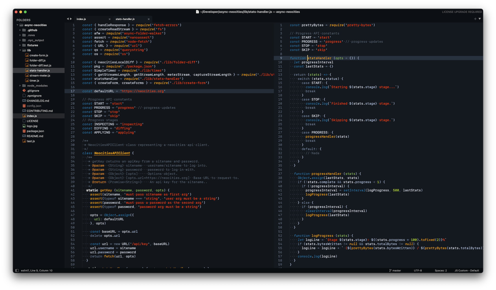
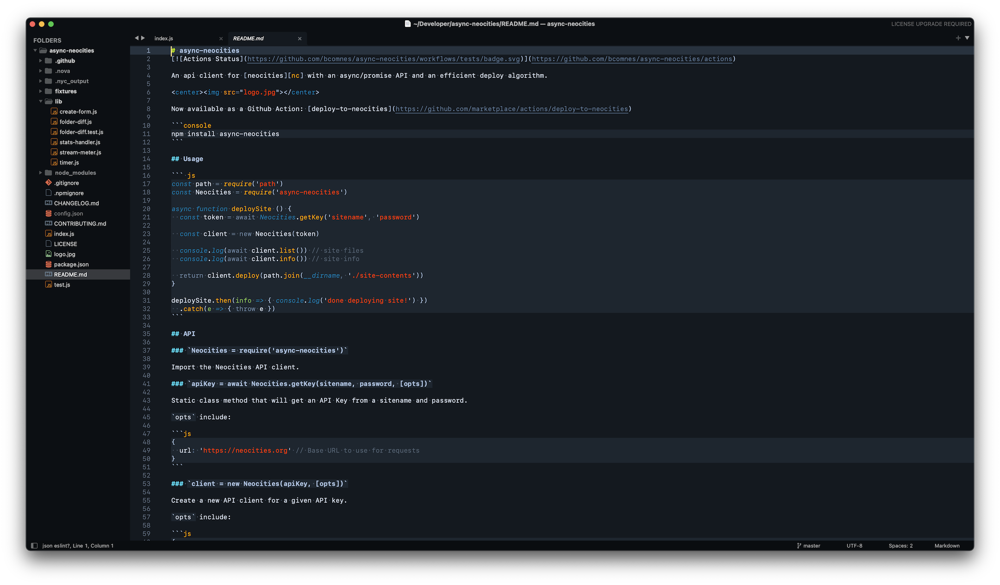
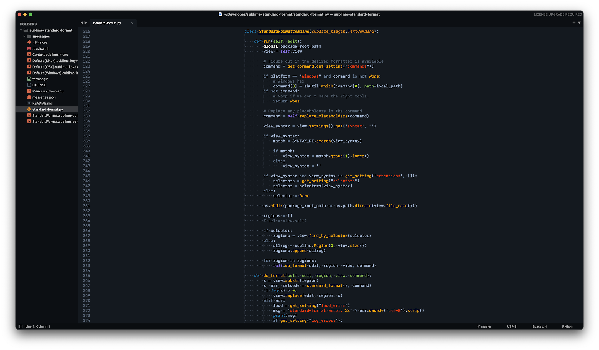
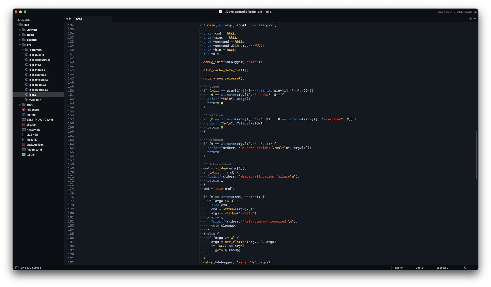
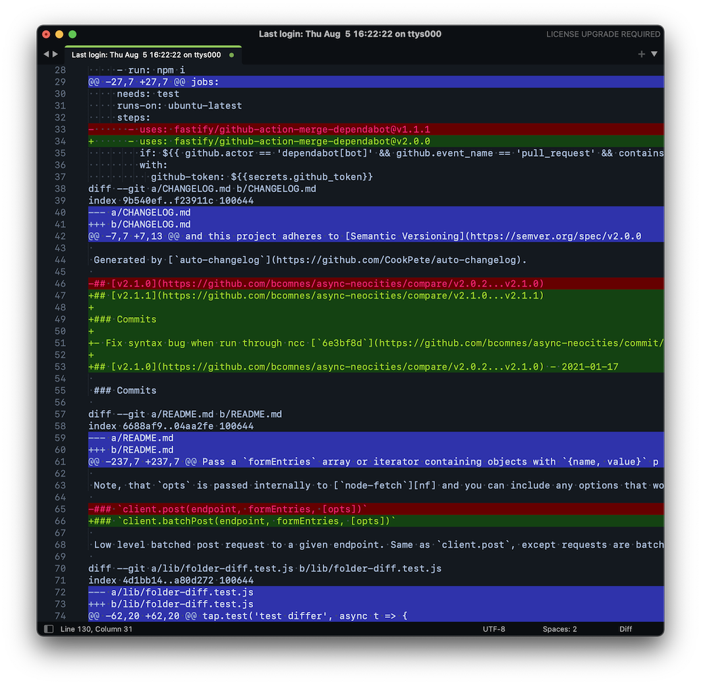

# sublime-tron-color-scheme

A standalone fork (and modification) of the Tron Legacy color scheme from [ColorSublime](http://colorsublime.com/?q=tron). Install the following package control package:

```
Tron Color Scheme
```

Then select the `Tron Legacy 4 (Dark)` color scheme from your preferences menu.

Supports all major syntaxes, Sublime Text 4 and is based on the new Marina syntax definition file (with some additional features.)











## Acknowledgments

Thank you Dayle Rees and Tim Heckman, the original creators of this fantastic theme.  Thank you ColorSublime for helping put so many fantastic color schemes out into the world.

## See Also

- [Tron Legacy Atom](https://atom.io/themes/one-tron-legacy-syntax)
- [Tron Legacy VSCode](https://marketplace.visualstudio.com/items?itemName=bcomnes.tron-legacy)
