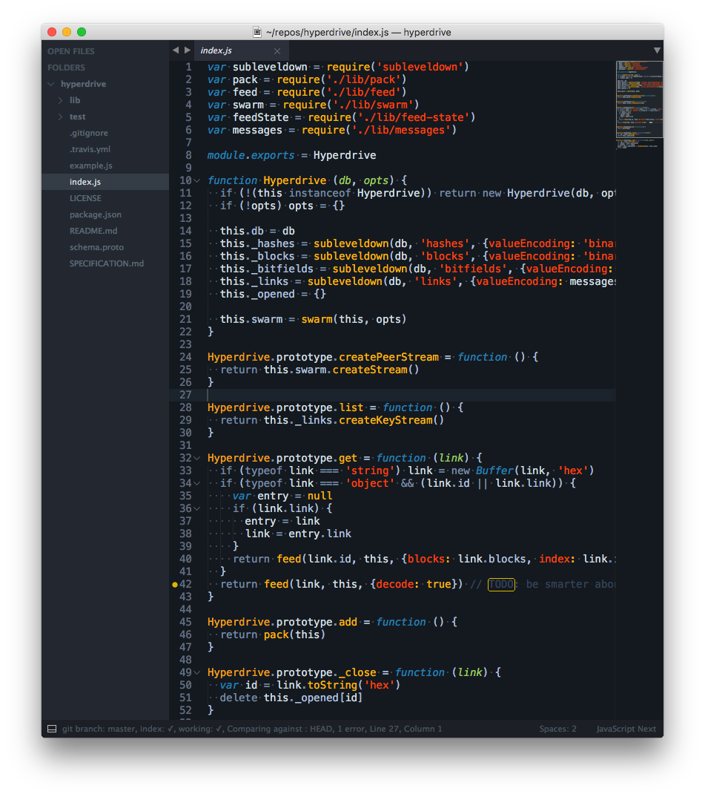
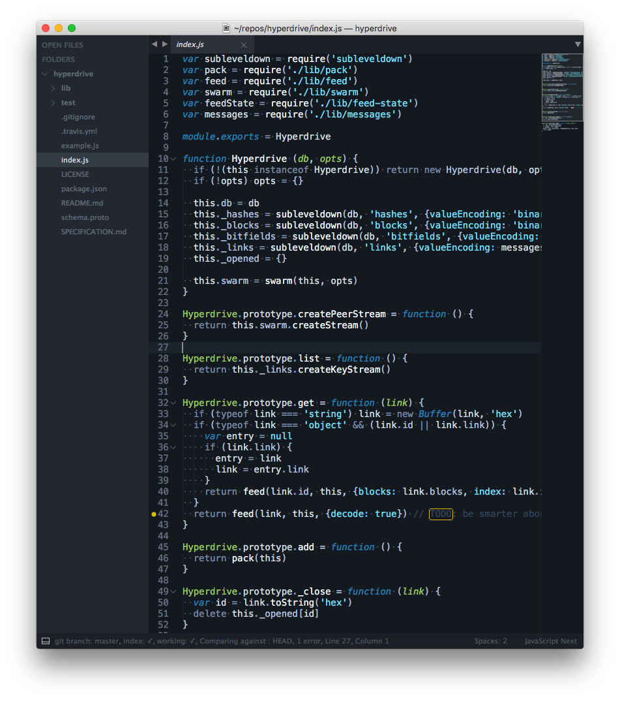

# sublime-tron-color-scheme

**WAITING ON PACKAGE CONTROL TO PUBLISH. SEE: https://github.com/bcomnes/sublime-tron-color-scheme/issues/3**

A standalone fork of the Tron and Tron Legacy color schemes from [ColorSublime](http://colorsublime.com/?q=tron). Install the following package control package:

```
Tron Color Scheme
```

ColorSublime is fun to play around with, but a second package manager for color schemes is a bit excessive.

Pairs nicely with the [spacegray](https://github.com/kkga/spacegray) UI theme and [Java​Script​Next - ES6 Syntax](https://packagecontrol.io/packages/JavaScriptNext%20-%20ES6%20Syntax) extended syntax highlighting.

Lacks good markdown or JSON support.  See [#Caveats](#caveats)





## Caveats

These themes have poor support for basic markdown currently.  (Somone should totally fix that by adding extended markdown support!)  The following sublime packages provide excellent markdown support:

- [Monokai Neue](https://packagecontrol.io/packages/Monokai%20Neue)
- [Monokai Extended](https://packagecontrol.io/packages/Monokai%20Extended)
- [Markdown Extended](https://packagecontrol.io/packages/Markdown%20Extended)

Its possible to set up syntax specific color highlighting to use an additional color scheme for markdown in lieu of Tron markdown support for the time being.

Here are some examples of how to do that:

**Sublime Text 3/Packages/User/Markdown Extended.sublime-settings** (or Markdown.sublime-settings):

```json
{
  "extensions":
  [
    "md",
    "markdown",
    "mdown",
    "mkdn"
  ],
  "color_scheme": "Packages/Monokai Extended/Monokai Extended Bright.tmTheme"
}
```

**Sublime Text 3/Packages/User/JSON.sublime-settings:**

```json
{
	"color_scheme": "Packages/Monokai Neue/Monokai-Neue.tmTheme",
	"draw_white_space": "all",
	"extensions":
	[
		"json",
		"sublime-settings"
	],
	"tab_size": 2
}

```

**Sublime Text 3/Packages/User/Markdown Extended.sublime-settings:**

## Acknowledgments

Thank you Dayle Rees and Tim Heckman, the original creators of this fantastic theme.  Thank you ColorSublime for helping put so many fantastic color schemes out into the world.  Thank you to the [dat team](http://dat-data.com/team) for creating the beutiful looking [hyperdrive](https://github.com/mafintosh/hyperdrive) code for the screenshots.
